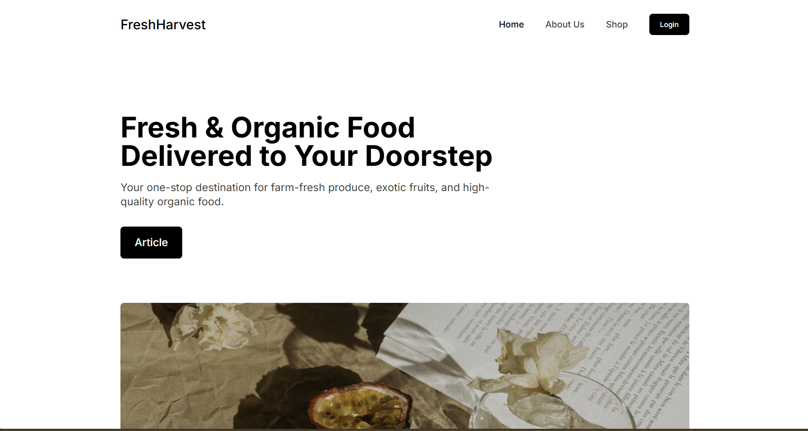

# Code Red - What The Figma

This is a website created for the NITT Hackathon 2025, specifically for the "What The Figma" event.

## Table of Contents
- [Introduction](#introduction)
- [Features](#features)
- [Installation](#installation)
- [Usage](#usage)
- [Contributing](#contributing)
- [License](#license)
- [Contact](#contact)
- [Acknowledgements](#acknowledgements)

## Introduction
Code Red - What The Figma is a project developed during the NITT Hackathon 2025. The goal of this project is to provide an interactive and user-friendly platform for designing and prototyping using Figma.

## Features
- User-friendly interface
- Real-time collaboration
- Extensive design tools
- Export options for various formats
- Responsive design
- Cross-platform compatibility

## Installation
To install and run this project locally, follow these steps:

1. Clone the repository:
  ```bash
  git clone https://github.com/yourusername/Code_Red_WhatTheFigma.git
  ```
2. Navigate to the project directory:
  ```bash
  cd Code_Red_WhatTheFigma
  ```
3. Install the dependencies:
  ```bash
  npm install
  ```
4. Start the development server:
  ```bash
  npm start
  ```

## Usage
Once the development server is running, open your browser and navigate to `http://localhost:3000` to start using the application.

## Contributing
Contributions are welcome! Please fork the repository and create a pull request with your changes. Make sure to follow the code of conduct.

## License
This project is licensed under the MIT License. See the [LICENSE](LICENSE) file for more details.

## Contact
For any inquiries or feedback, please contact us at:
- Email: support@codereadwhatthefigma.com
- GitHub Issues: [https://github.com/yourusername/Code_Red_WhatTheFigma/issues](https://github.com/yourusername/Code_Red_WhatTheFigma/issues)

## Acknowledgements
We would like to thank the following resources and individuals for their support and contributions:
- NITT Hackathon 2025 organizers
- Figma for providing an excellent design tool
- Open-source community for their invaluable resources and libraries
- Our mentors and peers for their guidance and feedback
- Our team members for their hard work and dedication

## Perview

